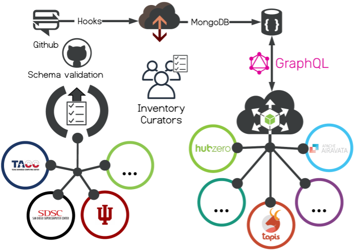

===================================================
Introduction to SCGI Inventory
===================================================

---------------------------------------------------
Version
---------------------------------------------------
This is version 0.1.0 of the SGCI Resource Description Specification schema. <LICENSE INFO>

---------------------------------------------------
Introduction
---------------------------------------------------

The user-facing components of the Cyberinfrastructure (CI) ecosystem, science gateways and scientific workflow systems,
share a common need of interfacing with physical resources (storage systems and execution environments) to manage data and execute codes (applications).

However, there is no uniform, platform-independent way to describe either the resources or the applications. To address this, we propose uniform semantics for describing resources and applications that will be relevant to a diverse set of stakeholders.

The SGCI Resource Description Specification provides a standard way for institutions and service providers to describe storage and computing infrastructure broadly available to the research computing and science gateway community. SGCI Resource descriptions provide a foundation for interoperability across gateway components and other cyberinfrastructure software.

The current, initial version of the resource description language focuses on “traditional” HPC and high-throughput storage and computing resources

---------------------------------------------------
Definitions
---------------------------------------------------
Definitions of terms used in the specification will be added here.

---------------------------------------------------
Specification Format
---------------------------------------------------
SGCI resource descriptions are JSON documents that conform to the JSONSchema definition describing a particular version of the SGCI Resource Description Specification.

---------------------------------------------------
Examples
---------------------------------------------------
We illustrate the main features of the specification by walking through a few prototypical examples.

**SCIGAP Development Storage**

A server or virtual machine providing storage accessible over SSH can be registered as resource with a single object
provided within the ``"storageResources"`` attribute describing the connection information and the file systems present.
In the SGCI Resource Descriptions specification, it is assumed that all resources provide some kind of storage
capability; that is, at least one object within the ``storageResources`` array attribute must be provided,  and within
that object, at least one ``connections`` object must be provided.

A fundamental principle in the SGCI Resource Description Specification is that the ``host`` attribute uniquely
identifies a resource, and only one description document for a given ``host`` can exist in the inventory. The value of
``host`` is a network addressable identifier for the resource, most typically, a fully qualified domain name.

The following example describes a hypothetical storage resource used by the SCIGAP framework in its development environment.

.. literalinclude :: ../../data/scigap-dev.iu.storage.json
   :language: javascript

**Corral Storage System at TACC**

The Corral storage system at TACC provides a more complicated example, with multiple file systems mounted onto
a single resource and multiple types of storage endpoints available.
The following example illustrates how a system like Corral, with many storage functionalities, can be described in a
single document using the specification.

.. literalinclude :: ../../data/corral.tacc.storage.json
   :language: javascript

**Carbonate HPC**

Compute capabilities provided by resources are described within one or more  ``computeResources`` definitions. Unlike the
``storageResources`` attribute that must contain at least one object, the ``computeResources`` attribute is entirely
optional. Each compute resource object must define at least one ``connections`` object, analogous to the ``storageResource``
definitions. Additionally, each compute resource defines the way workloads are scheduled on the resource using the
``schedulerType`` property, with values such as ``FORK`` or ``BATCH``. The value of ``schedulerType`` dictates additional
objects that may be provided, such as the ``batchSystem`` object for value ``BATCH``.

Carbonate is Indiana University's large-memory computer cluster. The simple description below only includes the ``BATCH``
submission capability and does not provide any partion (queue) information.

.. literalinclude :: ../../data/carbonateHPC.iu.compute.json
   :language: javascript

**TACC Stampede2 Cluster**

In the final example describing the TACC Stampede2 supercomputer, two ``computeResources`` definitions are included,
one with ``schedulerType`` having value ``BATCH`` and one with ``schedulerType`` having value ``FORK``.
While all "real" workloads are required to be submitted to the
batch scheduler, the ``FORK`` scheduler could be utilized for "code compilation" tasks that run
directly on the login node. Additionally, the ``BATCH`` compute resource includes descriptions of the partitions
(queues). These are optional but very valuable for science gateway projects.

.. literalinclude :: ../../data/stampede2.tacc.xsede.json
  :language: javascript

.. |reg|    unicode:: U+000AE .. REGISTERED SIGN

---------------------------------------------------
Integration
---------------------------------------------------

The SCGI Inventory is currently been integrated with Airavata, HUBzero |reg|  , and Tapis. We expect the inventory to be adapted by others soon.

**Links:**

https://github.com/SGCI/sgci-resource-inventory

https://github.com/SGCI/sgci-resource-inventory-cache-service

**Get Involved!**

Issues, Comments, PRs all welcome!

SGCI: help@sciencegateways.org

Email: jstubbs at tacc.utexas.edu, smarru at iu.edu, dmejiapa at purdue.edu
